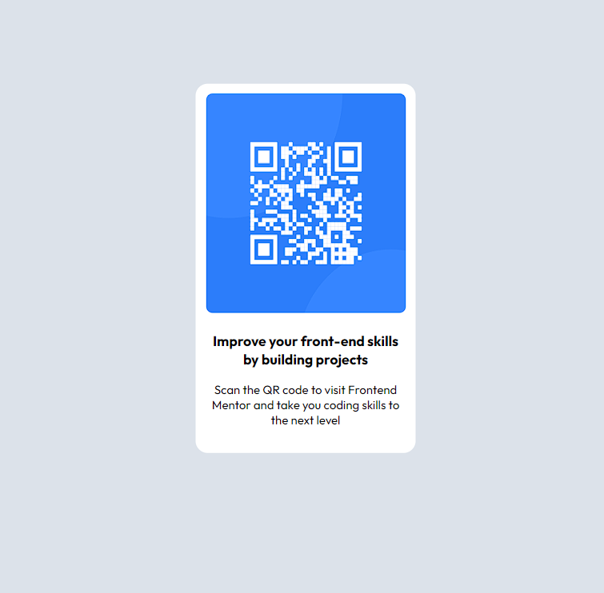

# Frontend Mentor - QR code component solution

This is a solution to the [QR code component challenge on Frontend Mentor](https://www.frontendmentor.io/challenges/qr-code-component-iux_sIO_H). Frontend Mentor challenges help you improve your coding skills by building realistic projects. 

## Table of contents

- [Overview](#overview)
  - [Screenshot](#screenshot)
  - [Links](#links)
- [My process](#my-process)
  - [Built with](#built-with)
  - [What I learned](#what-i-learned)
- [Author](#author)

## Overview

### Screenshot

### Links

- Solution URL: [Add solution URL here](https://your-solution-url.com)
- Live Site URL: [Add live site URL here](https://your-live-site-url.com)

## My process

Made a container for main component.Divided the image and the text and made the main container centered;made the content vertical.
### Built with

- HTML 
- CSS custom properties
- Flexbox

### What I learned

Learnt how to center the main component (QR-CODE)of the page used flex for dividing the component and aligning them and adding styles.This helped me to choose color close to the sample given 

To see how you can add code snippets, see below:

## Author

- Frontend Mentor - [@darshan744](https://www.frontendmentor.io/profile/darshan744)

